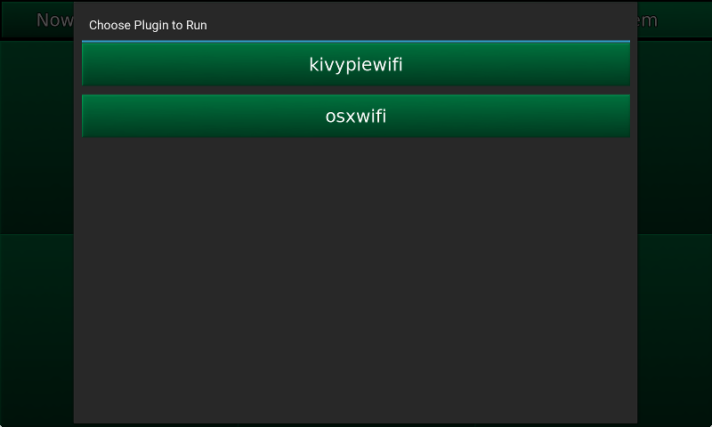

.. _plugins:

#######
Plugins
#######

Plugins are accessed via the System Tab:

.. image:: images/system.png

Upon clicking the Plugins button, you are presented with a list of all
available plugins in the ``~/.kmpc/plugins`` folder:

Pictured are some plugins that are available at
`https://github.com/eratosthene/kmpc-plugins
<https://github.com/eratosthene/kmpc-plugins>`_.

**********************
Plugin Folder Contents
**********************

Inside the ``~/.kmpc/plugins`` folder, there should be one or more folders
named for each plugin. Each plugin folder must contain *either* at least two
files named ``plugin.py`` and ``plugin.kv`` *or* a file named ``plugin.sh``::

  plugins
  ├── someguiplugin
  │   ├── plugin.kv
  │   └── plugin.py
  ├── somescript
  │   └── plugin.sh
  └── anothergui
      ├── plugin.kv
      └── plugin.py

GUI Plugins
===========

These are plugins that need to display an interface for interaction. They are
writtine in python and kv.

plugin.py
---------

This file contains the logic for a plugin, written in python. You can import
whatever you want, and it will have access to any global variables in the kmpc
application, including App. The only requirement is to have at least one class
named <pluginname>PluginContent, that is a subclass of some Kivy widget. So,
for example, the *kivypiewifi* plugin has the following in it:

.. code-block:: python

  class kivypiewifiPluginContent(BoxLayout):

Do whatever needs to be done, just make sure you are doing things in a
non-blocking manner. I prefer to use the twisted reactor and its associated
methods for this.

plugin.kv
---------

This file contains the presentation for a plugin, written in kv. It should
should contain at least the default kv declaration, an import for the plugin's
class, and a definition of that class. For example, the *kivypiewifi* plugin
has the following in it:

.. code-block:: python

  #:kivy 1.10.0
  #:import kivypiewifiPluginContent plugin.kivypiewifiPluginContent

  ... (skipping a few lines)

  <kivypiewifiPluginContent>:
    (here iss where the kv definition for your plugin goes)

Script Plugins
==============

These are plugins that just run another program. It might cover up the kmpc
interface, it might just do stuff in the background. They are defined in bash.

plugin.sh
---------

This is just a normal bash script that does whatever.

*******
Running
*******

When you click on a GUI plugin in kmpc to run it, the following things happen:

#. The *Choose Plugin to Run* popup is closed.
#. A new full screen popup is opened, with a Close button at the bottom.
#. The plugin's PluginContent class is instantiated, and placed inside the
   popup.

When you click on a script plugin in kmpc to run it, the following things
happen:

#. The chosen script is executed, with control returning to kmpc only after the
   script exits.
#. The *Choose Plugin to Run* popup is closed.
