.. _usingkmpc:

##############
Using ``kmpc``
##############

Here is a quick tour of the various tabs in kmpc and what everything does.

***********
Now Playing
***********

This is the default active tab when you first run kmpc. If there is no
currently playing music, you will see 'Playback Stopped'. If there is something
playing, it will look similar to this:

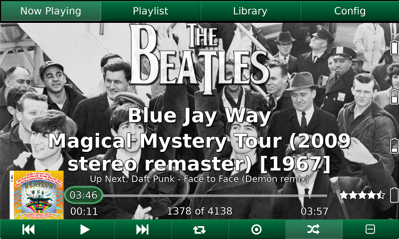

Main Tab Navigation
===================

Across the top are the various tabs you can switch to. Each of these will be
explained in following sections.

Current Track Info
==================

The background of this section will be pulled from the fanart directory based
on the current track artist, if at least one file exists in the
artistbackground folder for that artist.

First is the artist name section, which is pulled from the track artist tag.
This will either be rendered in normal text, or a logo image pulled from the
fanart folder. If there is more than one artist, all artists will be shown.

After that is the track name, then the album name, with the release year in
brackets afterwards. This is pulled from the original year tag if it exists,
and pulled from mpd otherwise. 

Under this is a smaller line detailing the upcoming artist and track.

Bottom Section
==============

At the bottom left is the album cover, if it can be pulled from the cover image
tag, or a blank space otherwise. You can click on it to popup a larger view,
and click outside the popup to dismiss it.

In the middle is the current track time. The time displayed inside the slider
is the remaining time. On the left is the elapsed time, and on the right is the
total time.

Below that is the track number. This shows the current track and the total
number of tracks in the current playlist.

On the bottom right is the song rating. This will display a ? if the song has
not yet been rated, or the value from 0-10 in half-star increments of the song
rating as pulled from mpd. This does not check the rating tag of the file.

Backlight Controls
==================

On the far right of the screen, there are four buttons to control the
brightness of the Raspberry Pi touchscreen. These do nothing if the rpienable
flag is not set to true in the config file. They change the brightness from
brightest at the top to dimmest at the bottom.

Playback Controls
=================

Along the very bottom of the screen are the playback controls. From left to
right, they are as follows:

Previous Track
  Goes to the previous track.
Play/Pause
  Pauses if playing, plays if paused or stopped.
Next Track
  Goes to the next track.
Toggle Repeat Mode
  If on, the current playlist (if Single Mode is off) or track (if Single Mode
  is on) will repeat indefinitely.
Toggle Single Mode
  If Repeat Mode is on, the current song will repeat. If Repeat Mode is off,
  then playback will stop after the current song.
Toggle Random Mode
  The playlist will be played back in random order if on.
Toggle Consume Mode
  If on, the current song will be removed from the playlist after playback.

Runtime Settings
================

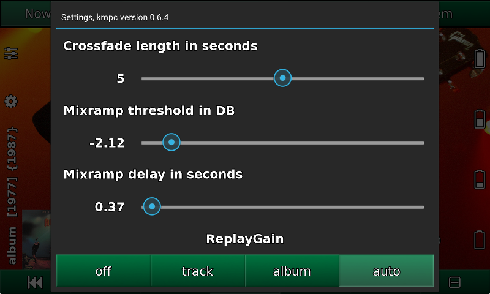

At the top left is a button to popup the runtime settings. This opens a menu
for various ancillary controls.

The first three sliders affect mpd's playback, and correspond to the
'crossfade', 'mixrampdb', and 'mixrampdelay' mpd options. Please see mpd's
documentation for explanation.

The toggle button at the bottom allows selection of Replaygain functionality.
Please see mpd's documentation for explanation.

Swiping left on the popup will bring up the next set of controls.

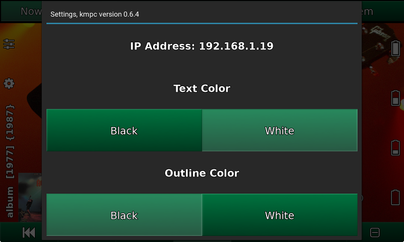

First is the current IP address of the host. kmpc tries to guess this
intelligently, returning either the local IP address or 127.0.0.1 if no network
is connected. This can be useful in determining whether the Pi in your car can
reach the wifi in your house.

The Text Color and Outline Color toggles let you change the color and outline
of text displayed in kmpc between white and black.

Configuration
=============

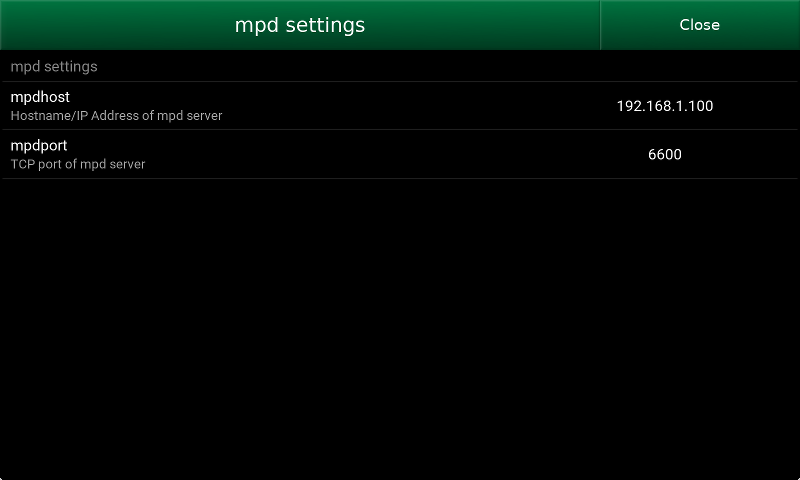

At the middle left is a button to open the configuration panel. This lets you
edit all the various settings in :ref:`the config file <config>`. At the top
left you can choose the section, and the values for that section will show up
for editing underneath. Hit Close when you are done.

********
Playlist
********

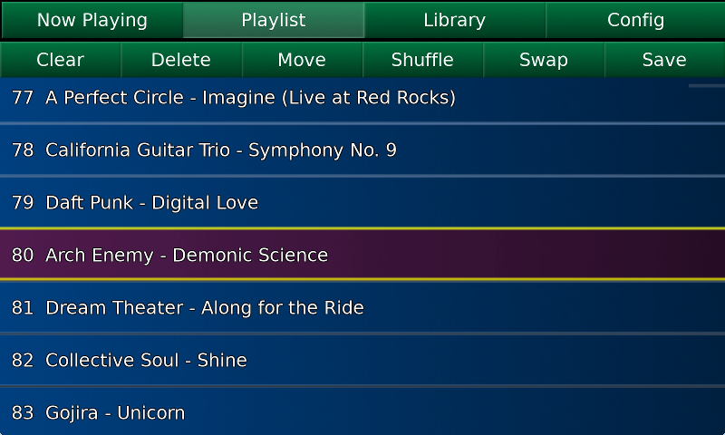

Function Buttons
================

Along the top, under the main tabs, are several function buttons. From left
right, they are as follows:

Clear
  Clears the playlist.
Delete
  Removes the currently selected track from the playlist.
Move
  Does nothing right now. Sorry.
Shuffle
  Shuffles all tracks on the playlist.
Swap
  Switch the position of two selected tracks. Must have exactly two tracks
  selected.
Save
  Saves the current playlist with a name.

List of Tracks
==============

Below the buttons is the list of tracks in the current playlist. This is
scrollable via touch, mousewheel, or click and drag. The currently playing
track is highlighted. Clicking on a track will select it for use with the above
function buttons. Long-pressing a track will start playing from that track.

*******
Library
*******

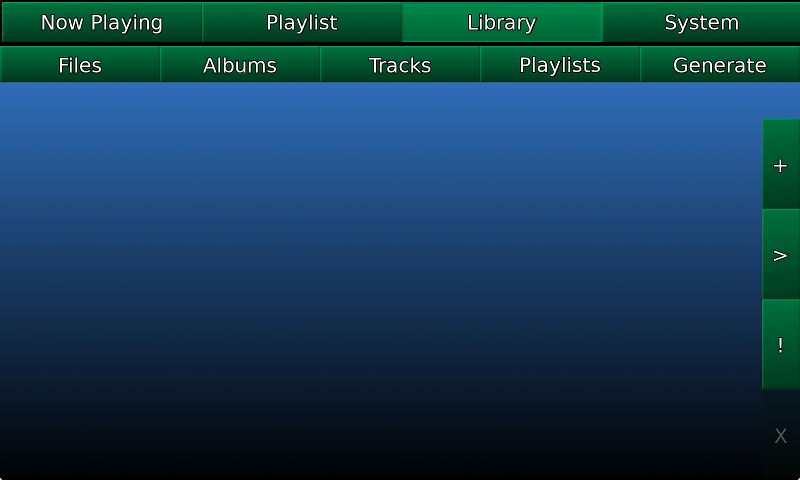

This tab lets you browse through mpd's library of songs. Along the top are the
different methods of browsing.

Files
  Directly browse the file tree. This is exactly how your files are stored on
  disk.
Albums
  A list of all album artists, with their respective albums inside.
Tracks
  A list of all artists, with their respective tracks inside.
Playlists
  A list of all saved playlists.

Along the right side, you will see several buttons. Their functions are as
follows:

\+ (Append)
  Appends the currently selected item to the playlist.
> (Insert)
  Inserts the currently selected item after the current track on the playlist.
! (Replace)
  Clears the playlist then adds the currently selected item.
X (Delete)
  Deletes the currently selected item. Only works in the Playlists section.

Files
=====

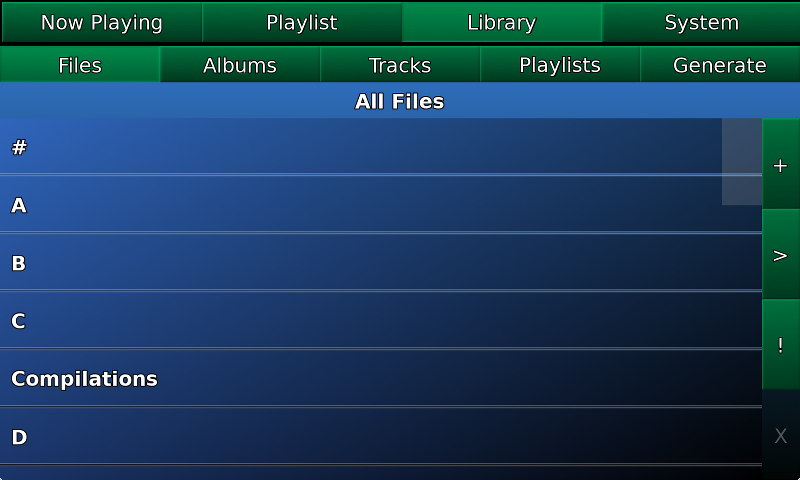

When you first click the Files tab, you are presented with the top level of the
filesystem. You can scroll, click to select, or long-press to descend into the
folder. As you descend, you can move back up by long-pressing the 'up to
<whatever>' line at the top. Once you get to the level of actual files,
long-pressing will replace the playlist with whatever is in the current folder,
and start playing from the file you long-pressed on. I recommend sorting your
files into subfolders in the following hierarchy to make this useful:

#. First letter of album artist name
#. Album artist
#. Album name, with original release year at the beginning

The following images show the descent into the filesystem. Note that file names
are shown without their file extensions.

+--------------------------------+--------------------------------+
| .. image:: images/library2.png | .. image:: images/library3.png |
+--------------------------------+--------------------------------+
| .. image:: images/library4.png | .. image:: images/library5.png |
+--------------------------------+--------------------------------+

Albums
======

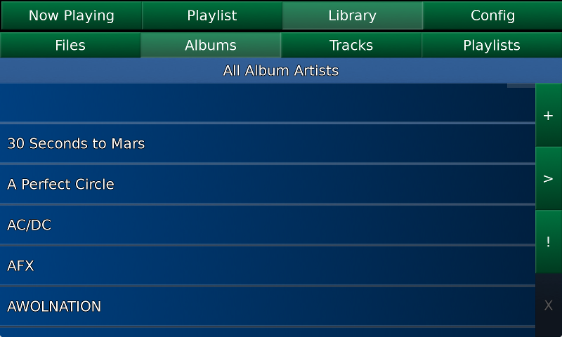

This lists all album artists, sorted alphabetically. You can scroll, click to
select, or long-press to descend into the folder. As you descend, you can move
back up by long-pressing the 'up to <whatever>' line at the top. Once you get
to the level of actual tracks, long-pressing will replace the playlist with the
current album, and start playing from the track you long-pressed on. The
following images show the descent into albums.

+--------------------------------+--------------------------------+
| .. image:: images/library6.png | .. image:: images/library7.png |
+--------------------------------+--------------------------------+
| .. image:: images/library8.png |                                |
+--------------------------------+--------------------------------+

Tracks
======

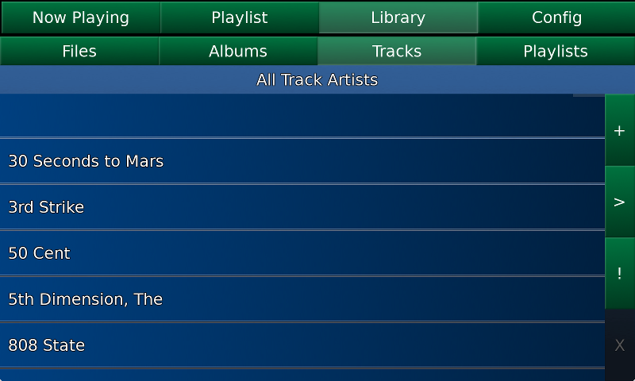

This lists all track artists, sorted alphabetically. You can scroll, click to
select, or long-press to descend into the folder. As you descend, you can move
back up by long-pressing the 'up to <whatever>' line at the top. Note that if
two tracks by the same artist have the exact same name, only the first one
found will show up in this list. The following images show the descent into
tracks.

+--------------------------------+---------------------------------+
| .. image:: images/library9.png | .. image:: images/library10.png |
+--------------------------------+---------------------------------+

Playlists
=========

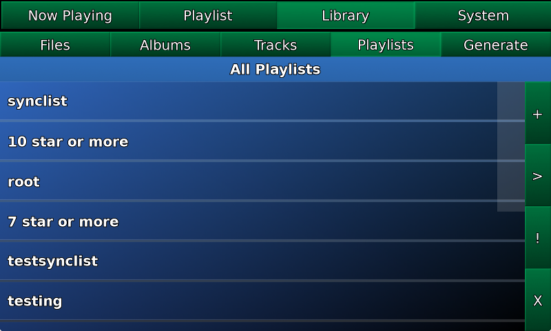

This lists all named playlists that mpd knows about. Long-pressing on a
playlist will replace the current playlist. You can also select one or more and
use the buttons to the right. '+' will append them, '>' will insert them, '!'
will clear the playlist then append them, and 'X' will delete them.

******
System
******

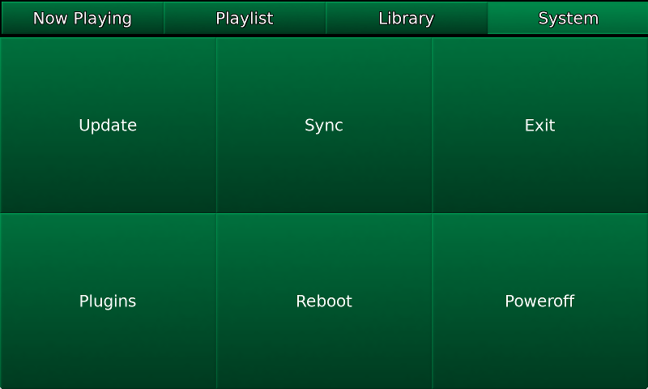

The Update button will run whatever command you have in the config file
``[system]`` section in the ``updatecommand`` field.

The Sync button interacts with the synchost, which is explained in the
following section.

Exit, Reboot, and Poweroff are pretty self-explanatory.

*************************
Syncing with the synchost
*************************

This is the way I have the system set up at my home. There is a Linux server on
my local network which contains all of my music (way more than I can fit on the
128G thumb drive connected to the Pi in my car), indexed by an mpd server
running on the same box. I use the ``kmpcmanager`` program to create a playlist
containing all the files I want to copy to the car (the *synclist*). This uses
both the star ratings (to set a threshold for the minimum rating to copy) as
well as another mpd sticker called 'copy_flag'. If 'copy_flag' is 'Y', the file
is always copied. If 'N', the file is never copied. 

When the 'Sync' button is pressed, you can choose between 'Fanart', 'Music',
'Ratings', or 'All'.

Fanart:
  #. The entire fanart directory is rsynced from *synchost*:*syncfanartpath* to
     *fanartpath* on the Pi.

Music:
  #. The *musicpath* directory on the Pi is walked, and any file not existing in the
     *synclist* is deleted.
  #. All empty directories in *musicpath* are deleted.
  #. ``rsync`` is run with the *synclist* as input to copy any new/updated files
     from the synchost to the Pi.
  #. The mpd database is updated.
  #. All files in the *synclist* are added to a playlist called 'root' on the
     Pi.

Ratings:
  #. All song rating stickers are exported from the Pi to the *synchost*.
  #. All song rating stickers are imported from the *synchost* to the Pi.
