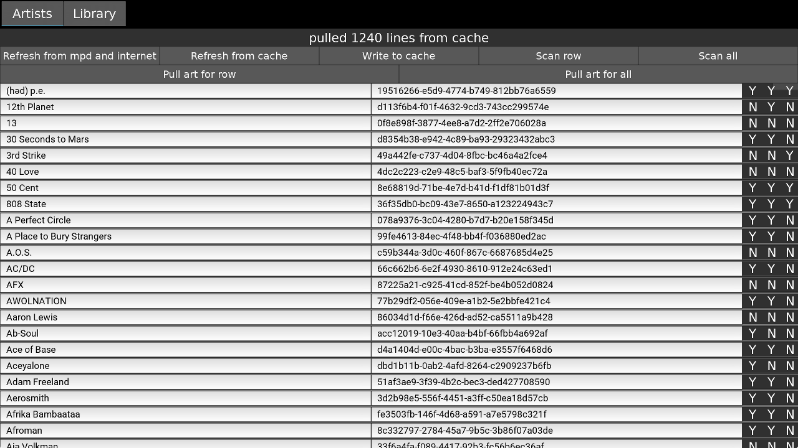
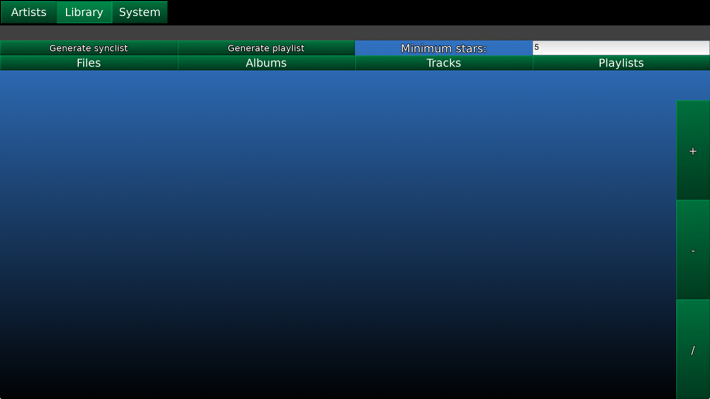
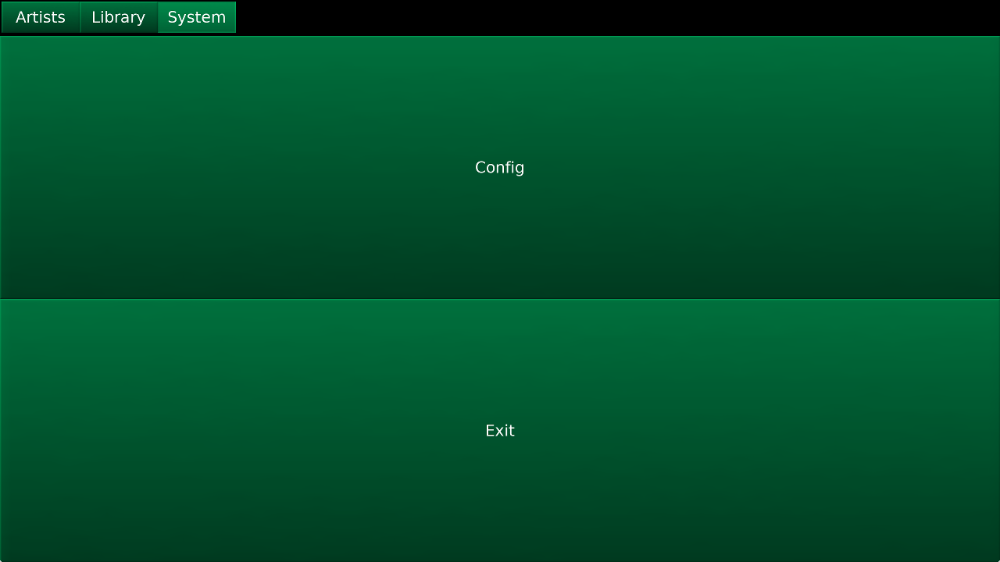

.. _usingkmpcmanager:

#####################
Using ``kmpcmanager``
#####################

The ``kmpcmanager`` app is meant to be run from your desktop, rather than from
the Pi. It provides many functions for supporting the synchost. It does not
have the level of polish that ``kmpc`` does, since I mostly just developed it
for personal use, however I will attempt to clean it up in the future. Make
sure you read the section on :ref:`the config file <config>` as there are
values you need to change.

The easiest way to use this app, if you aren't running it directly on the
synchost, is to mount the 'music' and 'fanart' folders from the synchost on to
your desktop. Change the config values 'musicpath' and 'fanartpath' to match
the mounted folders. Change the 'synchost' value to the hostname or IP address
of the synchost. Change the 'syncmusicpath' and 'syncfanartpath' to the folders
*as they exist on the synchost*.

At startup, a cache of the artist data will be read from
``~/.kmpc/artist_cache.pkl`` if it exists. Data is pulled from `MusicBrainz
<https://musicbrainz.org/>`_ and `FanArt.tv <https://fanart.tv/>`_.

***********
Artists Tab
***********

Functions
=========

Across the top are various buttons that perform functions, as follows:

Status bar
  Prints information about the currently running operation
Refresh from mpd and internet
  Asks mpd for a list of all 'musicbrainz_artistid' tags, then iterates that
  list, pulling data from MusicBrainz, and populating the scrollview below.
  Since MusicBrainz only allows one query per second, this can take quite
  awhile on first run if your music collection is large.
Refresh from cache
  Manually reload the artist cache from disk. Rarely used.
Write to cache
  Manually write artist cache to disk. Do this at least once after running the
  'Refresh from mpd and internet' task to ensure you don't have to do that
  again.
Scan row
  Scans the selected artist row for fanart media. This will update the columns
  to the right of that row.
Scan all
  Loops through every artist row and scans for fanart media, then updates the
  columns on the right.
Pull art for row
  Connects to FanArt.tv and pulls logo and background media for the selected
  artist row. If files are found in the 'hdmusiclogo' or 'musiclogo' section
  for that artist, they are downloaded to the 'logo' folder in the fanart
  directory for that artist, then trimmed to the smallest possible size. If
  files are found in the 'artistbackground' section for that artist, they are
  downloaded to the 'artistbackground' folder in the fanart directory for that
  artist. If files already exist in one of these folders, the operation is
  aborted, so as to not waste time.
Pull art for all
  Loops through every artist row and pulls media.

Artist rows
===========

The following data is shown from left to right:

* Artist name
* MusicBrainz ArtistId
* Whether at least one artistbackground exists
* Whether at least one logo exists
* Whether at least one badge exists

Artist name and id are selectable for easy copy/pasting.

Directory structure for fanart
==============================

The directory structure for fanart is as follows, with *\<fanartpath\>* as the
root folder::

  fanartpath
  ├── 078a9376-3c04-4280-b7d7-b20e158f345d    # musicbrainz artistid
  │   ├── __Artist Name__                     # empty file, optional
  │   ├── artistbackground                    # player background images
  │   │   ├── 132224.jpg                      # you can have as many
  │   │   ├── 39392.jpg                       # as you want
  │   │   ├── 4679.jpg                        # or none at all
  │   │   ├── 4680.jpg                        # format is 1280x720 JPG
  │   │   └── 7578.jpg
  │   ├── logo                                # artist logo images
  │   │   ├── 130819.png                      # you can have as many
  │   │   ├── 45979.png                       # as you want
  │   │   ├── 15469.png                       # or none at all
  │   │   ├── 47981.png                       # format is transparent PNG
  │   │   ├── 39562.png                       # maximum 800x310
  │   │   └── 5624.png
  │   └── badge                               # artist badge images
  │       ├── 130819.png                      # you can have as many
  │       ├── 45979.png                       # as you want
  │       ├── 15469.png                       # or none at all
  │       ├── 47981.png                       # format is transparent PNG
  │       ├── 39562.png                       # squarish aspect ratio
  │       └── 5624.png
  └── 391c9402-6688-4c3d-8f3d-d320d31b4de9    # and so on
      ├── __Another Artist__
      └── logo
          └── 154355.png

Badges
------

Badges are simply logos that have been manually moved to the 'badge' folder of
an artist. This is to handle artists that have symbols or other types of
squarish aspect ratio logos that do not explicitly spell out the artist's name.
An example is Dream Theater's 'Majesty' symbol, or Metallica's 'ninja star'
symbol. Since the artist logo should clearly state the artist's name for
legibility in kmpc, these files are kept separate.

There is not currently any sort of automatic handling of these files as
FanArt.tv does not treat them differently. I wrote a script to find all files
of squarish aspect ratio and print them to the screen for further manual
sorting.

kmpc does not currently do anything with these files, but there are plans in
the future to use them somehow.

***********
Library Tab
***********

This functions similarly to the library browser in ``kmpc``, with a few
different functions. Long-presses have been replaced by double-clicks to make
it easier to use on the desktop. The functions of the top row of buttons are as
follows:

Generate synclist
  Create a sync playlist based on a combination of the 'Minimum stars' field,
  the song ratings in mpd, and the copy_flag stickers in mpd. Uses the config
  file variable 'syncplaylist' as the name of the generated playlist.
Generate playlist
  Generates a playlist based on the 'Minimum stars' field and saves it to the
  synchost's mpd.
Minimum stars
  The minimum song rating to be considered for rsync or playlist.

Under these you will find the familiar library browsing modes. Additional data
is displayed in the scrollview rows. First is the song rating in stars. If no
rating exists, a '?' will be displayed. Since mpd only supports per-file
rating, anything that is not a track will display a '?' initially. After that
is the copy_flag field. This will display a 'Y' if copy_flag is set to true, a
'N' if set to false, and nothing if it is not set.

To the right are three buttons, which toggle the copy_flag. '+' will set it to
true, '-' to false, '/' will clear it. These buttons function at the directory,
file, artist, album, and track level.

**********
System Tab
**********

This tab has two functions. Config lets you edit the config file. Exit exits.

********
Workflow
********

Here's how I use the manager. For all tracks that I want on my car Pi no matter
what, I set copy_flag to true. For tracks that don't need to be on there, I set
it to false. I use this, for example, to manage greatest hits or compilation
albums so that multiple copies of the same track aren't taking up extra space.
I'll set only unique tracks on those albums to true or clear and everything
that exists on some other album to false.

Then I generate the synclist based on a minimum 7-star rating. This makes sure
that only songs I actually want to listen to end up on my car Pi, and no disk
space is wasted with duplicate tracks. However, my home music collection can be
complete and much more extensive.

The ``~/.ssh/config`` file is set up correctly on the car Pi to connect to the
synchost, and it is running on the same network the car Pi connects to when I
am at home. When I want to sync music, fanart media, and/or song ratings, I
just have to press the 'Sync' button in kmpc on the car Pi and everything
works. I also sometimes ssh into the car Pi and run the commandline sync
commands instead if I know it's going to take awhile and I don't want to sit in
the car staring at the screen.
